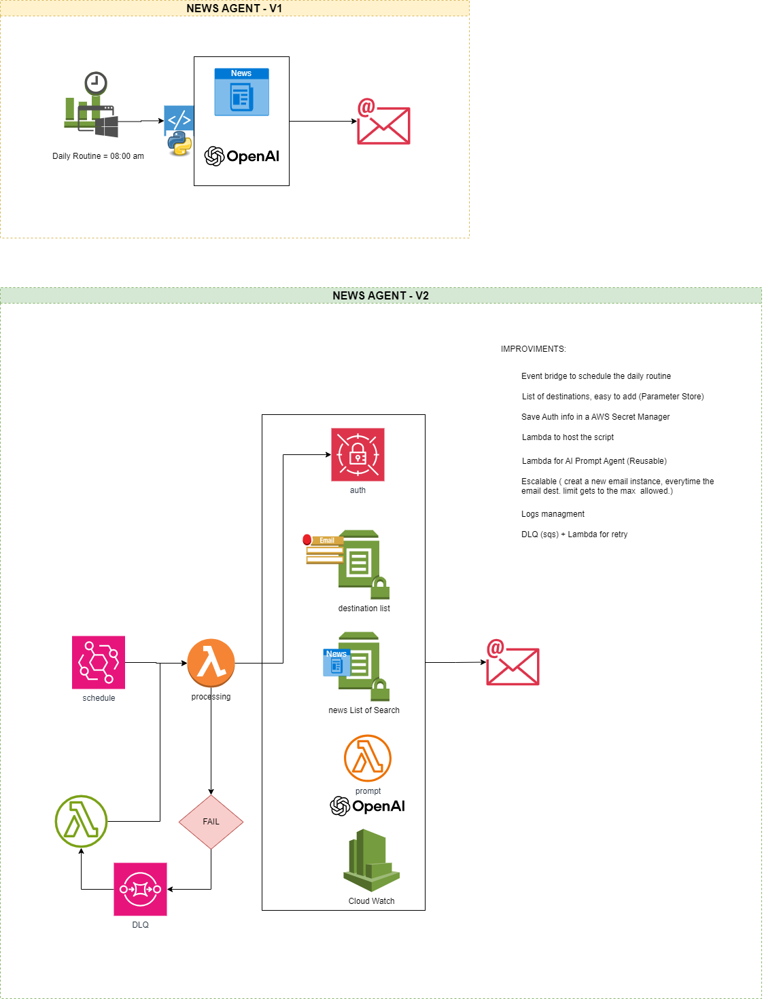

# Practice AI Agents

---

### 1. Climate
--- 

Getting started with AI agents using OpenAI and OpenWeather.

This project is a Python script that collects news from various worldwide websites. It uses AI to summarize and translate the content (if needed), and sends an email containing a short summary along with reference links.

#### Prerequisites

Before running the script locally, you need to set up access to the required APIs:

##### 1. OpenAI
- Create an account at [OpenAI](https://platform.openai.com/).
- Generate an API token.
- **Note:** You may need to purchase credits to use OpenAI's API.

##### 2. OpenWeather
- Create an account at [OpenWeather](https://openweathermap.org/api).
- Generate an API token, or use the default one if provided.

#### Local Setup

1. In the root directory of the project, create a folder named `auth`.
2. Inside the `auth` folder, add your tokens in plain `.txt` files:
    auth/
    ├── openai_token.txt
    └── openweather_token.txt

3. **Important:**
- Keep these tokens **local only**.
- **Never upload personal tokens to GitHub or any public repository.**

#### Running the Script

Once your tokens are in place, run the Python script:

```bash
python your_script_name.py
```

--- 
### 2. News Agent
---
The News Agent is a lightweight, serverless Python-based project that fetches news from trusted global and Brazilian sources, summarizes them using OpenAI, and emails the results in a concise format with original reference links.

The script currently pulls news from 4 Brazilian and 8 international sources but is designed to scale easily by adding more sources or changing existing ones.

#### 🔧 What It Does

- Collects daily news from well-known websites.
- Uses OpenAI to summarize content into short, readable paragraphs.
- Adds the source link at the end of each summary.
- Sends the results via email to a defined list of recipients.

#### 🧱 Architecture

Two versions of the architecture have been implemented:

##### **MVP V1**
- Simple Python script run on a daily schedule (e.g., 8:00 AM).
- Gathers news → Summarizes using OpenAI → Sends via email.
- Minimal infrastructure, no retry or logging mechanisms.

##### **MVP V2 (Improved and Scalable)**

- Uses AWS services for scalability, observability, and maintainability.
- EventBridge to trigger daily runs.
- AWS Lambda for both the processing logic and OpenAI prompt generation.
- Secrets Manager to store authentication securely.
- Parameter Store for managing the destination email list.
- CloudWatch for logs and monitoring.
- DLQ (Dead Letter Queue) with a retry Lambda for failure handling.
- Easily extendable to handle email limits or add new news sources.

#### 📌 Improvements in V2 include:

- Modular Lambda functions.
- Secret and parameter management.
- Scalable email logic (handling email limits).
- Retry and logging mechanism via DLQ + CloudWatch.

#### 🖼 Architecture Diagram

